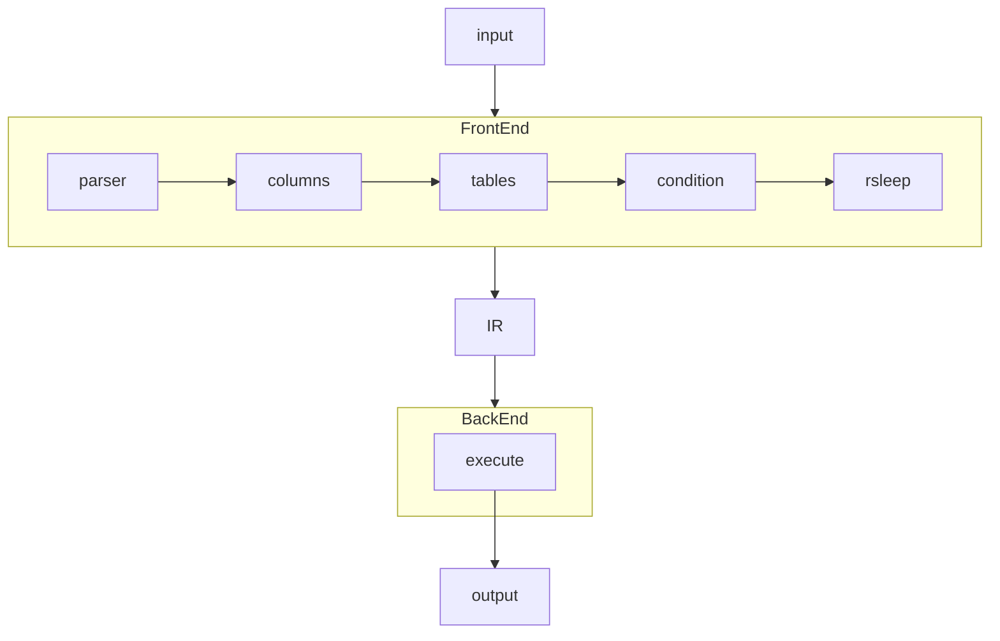

# rossoc

rossoc はSQLからコードを生成する実験的なプロジェクトです。  
SQLを mruby, mruby/c, と Arduino に変換します。 


rossoc is an experimental project to generate code from sql.  
Converts sql to mruby, mruby/c, or Arduino source code.

# Guide

例えば、`SELECT din11 FROM mruby WHERE ((din1 = 0 AND din2 <= 1) OR din3 <> 9)` のようなSQLは以下のようなコードに変換されます。  

For example, SQL like `SELECT din11 FROM mruby WHERE ((din1 = 0 AND din2 <= 1) OR din3 <> 9)` is converted to source code like this:

```ruby
# SELECT `din11` FROM `mruby` WHERE ((`din1` = 0 AND `din2` <= 1) OR `din3` <> 9)

GPIO.setmode(11, GPIO::IN)
GPIO.setmode(1, GPIO::IN)
GPIO.setmode(2, GPIO::IN)
GPIO.setmode(3, GPIO::IN)

uart1 = UART.new(1)

while 1 do
  din11 = GPIO.read(11)
  din1 = GPIO.read(1)
  din2 = GPIO.read(2)
  din3 = GPIO.read(3)

  if ((din1 == 0 && din2 <= 1) || din3 != 9)
    uart1.puts("din11=#{din11}")
  end

end
```

この mruby コードは次のコマンドで出力できます。  

This mruby code can be output with the following command.

```bash
rossoc query -i 'SELECT din11 FROM mruby WHERE ((din1 = 0 AND din2 <= 1) OR din3 <> 9)' -o test.rb
```

sleep 関数を使用できます。`RSLEEP` は rossoc の独自キーワードです。


You can also use the sleep function. `RSLEEP` is the original keyword of rossoc.

```bash
rossoc query -i 'SELECT din11 FROM mruby WHERE ((din1 = 0 AND din2 <= 1) OR din3 <> 9) RSLEEP 100' -o test.rb
```

`RSLEEP` を使用したコードは以下のようになります。

The code will look like this.

```ruby
# SELECT `din11` FROM `mruby` WHERE ((`din1` = 0 AND `din2` <= 1) OR `din3` <> 9) RSLEEP 100

GPIO.setmode(11, GPIO::IN)
GPIO.setmode(1, GPIO::IN)
GPIO.setmode(2, GPIO::IN)
GPIO.setmode(3, GPIO::IN)

uart1 = UART.new(1)

while 1 do
  din11 = GPIO.read(11)
  din1 = GPIO.read(1)
  din2 = GPIO.read(2)
  din3 = GPIO.read(3)

  if ((din1 == 0 && din2 <= 1) || din3 != 9)
    uart1.puts("din11=#{din11}")
  end

  sleep(100)

end
```

rossoc は `SELECT` ステートメントのみサポートしています。  
カラムには `din1` から `din20` と `ain1` から `ain20` を指定できます。dinはデジタルピン、ainはアナログピンです。  
テーブル名には `mruby`, `arduino` と `dev` が指定できます。
もし `dev` を指定したときシンプルなrubyコードを出力します。 このコードは物理的なボードを必要としません。


rossoc is only `SELECT` statements are supported.  
The values ​​that can be specified for the column name are `din1` to `din20` and `ain1` to `ain20`. din corresponds to digital pin, and ain corresponds to analog pin.  
Possible values ​​for table name are `mruby`, `arduino` and `dev`.  
If you specify `dev`, simple ruby ​​code will be output and you can run it immediately without a board.

# Reference

このプロジェクトでは以下の文献、コード等を参考にしています。  

The following code is included to extend sql: https://github.com/cryodex/sql-parser  
mruby, mruby/c Common I/O API Guidelines and Community-developed Libraries: https://github.com/mruby/microcontroller-peripheral-interface-guide


# Architecture

rossoc はフロントエンドとバックエンドから構成されています。
独自のIR(中間表現)を介してフロントエンドとバックエンドを接続しています。  
フロントエンドは、字句、構文、意味解析を実行します。
バックエンドは、ターゲットのコードを生成します。

rossoc is composed of a front-end and a back-end.  
An original IR(Intermediate Representation) is used to connect the front-end and the back-end.  
The front-end performs lexical, syntactic and semantic analysis.  
The back-end generates code for the target.

